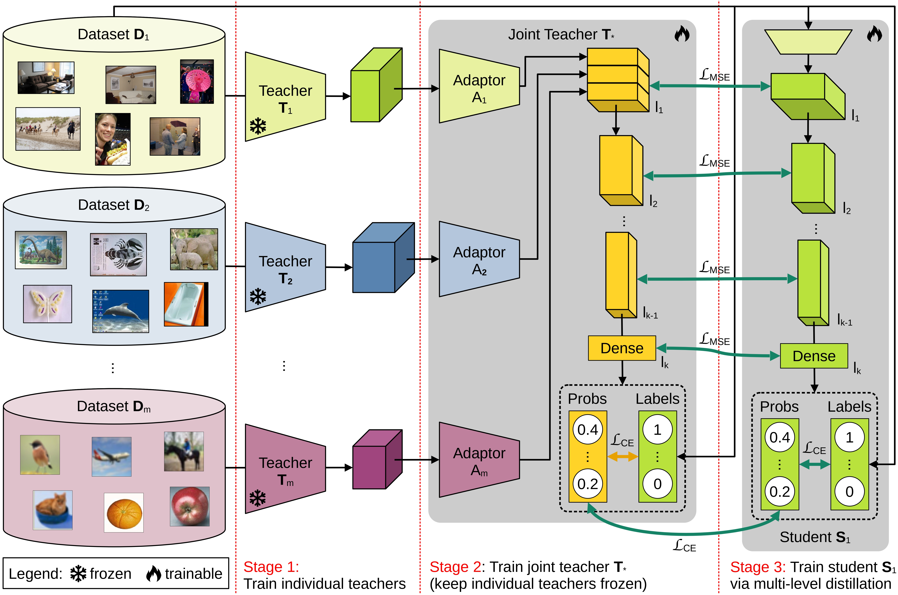

# Multi-Level Feature Distillation of Joint Teachers [WACV25]
Official implementation of
***"Multi-Level Feature Distillation of Joint Teachers Trained on Distinct Image Datasets"*** (WACV 2025). [[Paper]](https://arxiv.org/abs/2410.22184)

## Overview
<p align="center">
    
</p>

## Introduction
We propose a novel teacher-student framework to distill knowledge from multiple teachers trained on distinct datasets. Each teacher is first trained from scratch on its own dataset. Then, the teachers are combined into a joint architecture, which fuses the features of all teachers at multiple representation levels. The joint teacher architecture is fine-tuned on samples from all datasets, thus gathering useful generic information from all data samples. Finally, we employ a multi-level feature distillation procedure to transfer the knowledge to a student model for each of the considered datasets. We conduct image classification experiments on seven benchmarks, and action recognition experiments on three benchmarks. To illustrate the power of our feature distillation procedure, the student architectures are chosen to be identical to those of the individual teachers. To demonstrate the flexibility of our approach, we combine teachers with distinct architectures. We show that our novel Multi-Level Feature Distillation (MLFD) can significantly surpass equivalent architectures that are either trained on individual datasets, or jointly trained on all datasets at once. Furthermore, we confirm that each step of the proposed training procedure is well motivated by a comprehensive ablation study.


## Citation

```bib
@misc{iordache2024multilevelfeaturedistillationjoint,
      title={Multi-Level Feature Distillation of Joint Teachers Trained on Distinct Image Datasets}, 
      author={Adrian Iordache and Bogdan Alexe and Radu Tudor Ionescu},
      year={2024},
      eprint={2410.22184},
      archivePrefix={arXiv},
      primaryClass={cs.CV},
      url={https://arxiv.org/abs/2410.22184}, 
}
```
